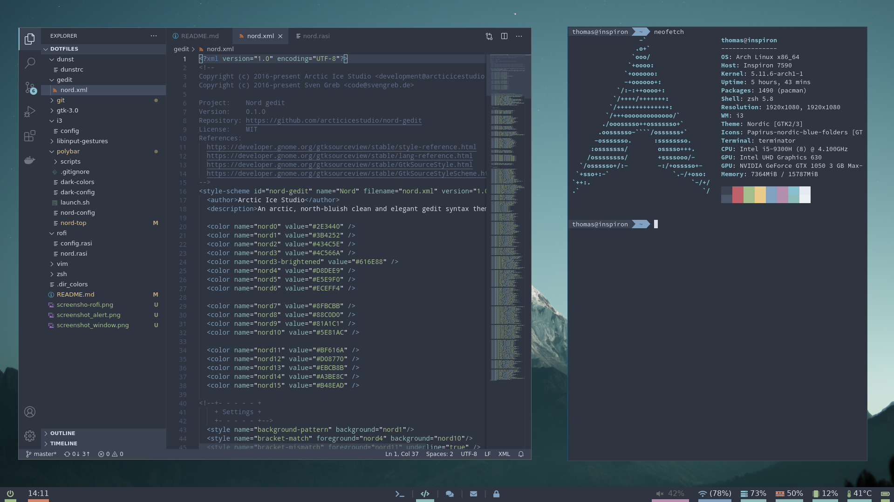
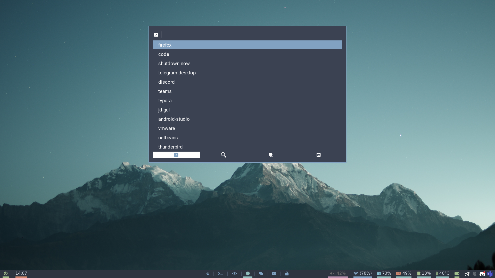
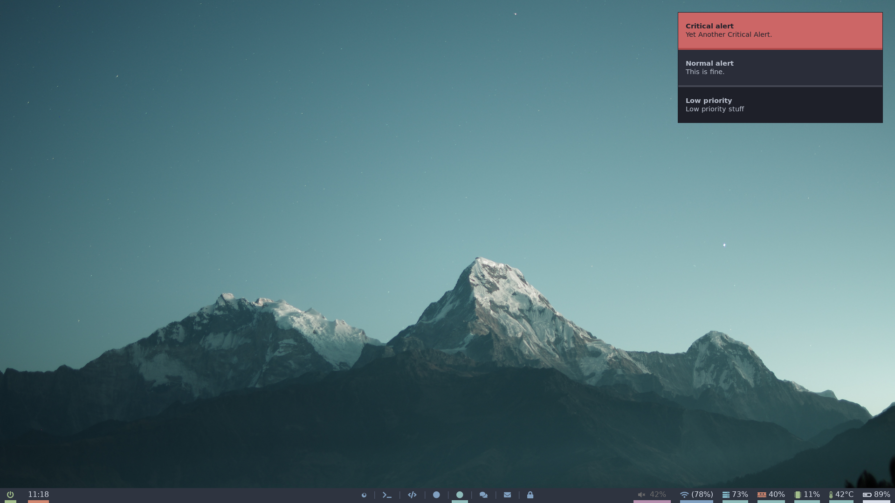

# Dotfiles

<psan>
<psan>

------

| | |
|-|-|
| **Shell:** | zsh + ohmyzsh |
| **DM:** | lightdm + lightdm-mini-greeter |
| **WM:** | i3wm + polybar |
| **Editor:** | VSCode with [Nord Theme](https://github.com/arcticicestudio/nord-visual-studio-code) (and occasionally Vim) |
| **Terminal:** | terminator |
| **Launcher:** | rofi |
| **Browser:** | firefox |
| **GTK Theme:** | [Nordic](https://github.com/EliverLara/Nordic) |
| **Icon Theme:** | [Nordic folders for papirus](https://github.com/basigur/papirus-folders-nordic) |

-----
